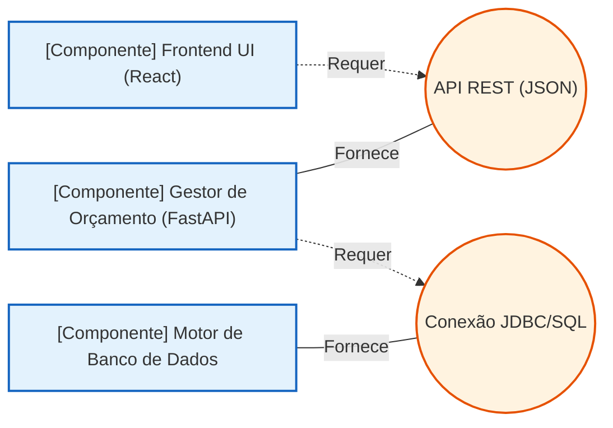

### O verdadeiro propósito do Diagrama de Componentes

O Diagrama de Componentes da UML é um diagrama estrutural focado em mostrar como os sistema é subdividido em **módulos de software substituíveis e reutilizáveis** e como eles se comunicam através de **interfaces.**

Ele encapsula a complexidade interna. Em vez de olhar para dados brutos, ele olha para blocos de código ou serviços.

- **O que ele representa**: Biblioteca (DDL,JARs), APIs, micro serviços, pacotes de software, ou módulo funcionais independentes.
- **Conceito Chave**: Interfaces Fornecidas (o que o componente oferece) e interfaces Requiridas( o que o componente precisa de terceiros para funcionar).

Imagine um sistema onde uma API backend em FastAPI atua como um componente independente que fornece serviços de dados para um componente frontend construído em React, comunicando-se via REST.

### Como os dados persistentes são realmente representados?

Se o objetivo do projeto é documentar dados persistentes, tabelas de bando de dados (como no PostregreSQL) e seu relacionamento (chave primária e estrangeira), a abordagem correta é:

- **Padrão do mercado(Fora da UML)**: Ultiliza-se a Modelagem de Dados Tradicional especificamente o **Diagrama Entidade-Relacionamento(DER)**.
- **Dentro da UML**: Utiliza-se o **Diagrama de Classes**. Para representar um modelo físico de banco de dados, o diagrama de classes é adaptado usando perfis e estereótipos específicos(ex: marcando um classe com `<<table>>` e seus atributos com `<<column>>`,`<<PL>>`,`<<FK>>`)

#### Componentes

