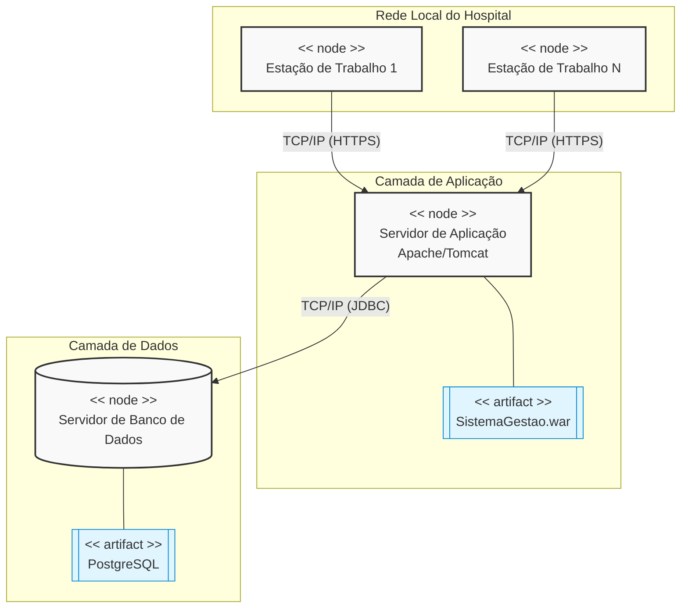

O **Diagrama de Implantação** modela a arquitetura física de um sistema. Ele mostra a configuração de nós de processamento em tempo de execução(hardware) e os artefatos de software que "vivem" neles

Enquanto diagramas de classes ou sequência ocam na lógica de software, p diagrama de implantação responde à pergunta: "**Onde este código vai rodar e como essas máquinas se comunicam?**"

### Representação de Cenário (Gestão Hospitalar)

### Elementos Chave do Diagrama

Para consolidar o conhecimento estrutural da UML.

- **Nó(Node)**: Representa um recurso de hardware ou ambiente de execução. utilizamos o estereótipo `<<node>>`. Exemplo: Servidores físicos, máquinas virtuais, smartphones, roteadores.
- **Artefatos(Artifact)**: É o produto físico gerado pelo processo de desenvolvimento de software que é implantado em um nó. Exemplo: arquivos, executáveis, bibliotecas dinâmicas, ou scripts.
- **Caminho de Comunicação(Communication Path)**: Representa a conexão física ou lógica entre os nós. Em um projeto real, é vital especificar o protocolo utilizado (ex:TCP/IP,HTTPS,Bluetooth,JDBC) para avaliar a segurança e a latência da comunicação

>[!info] Ponto de Atenção Arquitetural
>Ao Desenhar a arquitetura de projetos web full-stack modernos, as "estações de trabalho" frequentemente rodam apenas o navegador(o artefato seria o bundle do front, como React). O servidor de aplicação hospedada a API (ex: FastAPI), e o servidor de banco gerencia os dados(ex:PostegreSQL)