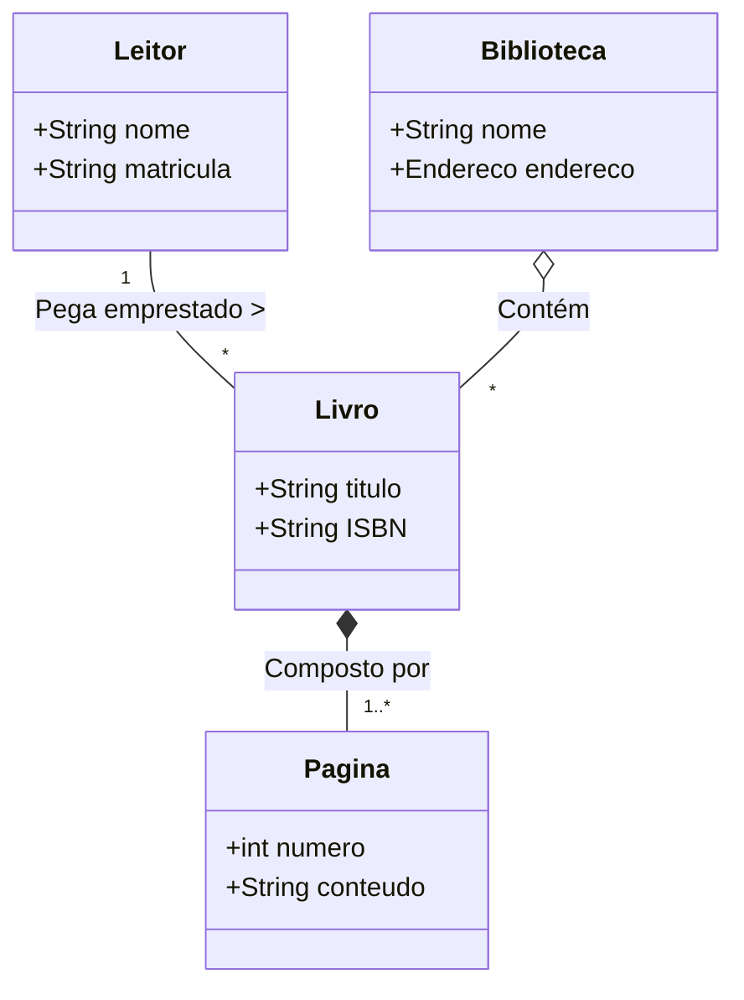

## Associação (Relação Estrutural Simples)

É o relacionamento mais básico. Indica que duas classes se conhecem e se comunicam, mas não existe uma relação de "parte de um todo". Elas são independentes.
Um `Leitor` está associado a um `Livro` (ele pega emprestado). Se o Leitor deixar de existir(cancelar o cadastro), o Livro Continua existindo. Se o Livro for descartado, o Leitor continua existindo.
Uma linha simples conectando as classes

## Agregação(Relação Todo-Parte "Fraca")

É um tipo especial de associação. Representa uma relação onde uma classe "maior" (o Todo) é formada por classes "menores" (as Partes). A palavra-chave é **fraca**, o que significa **independência de ciclo da vida**. A Parte pode existir sem o Todo.
Uma `Biblioteca` agrega `Livros`. Os livros fazem parte do acervo de biblioteca. Porém, se a Biblioteca falir e o prédio for demolido, os Livros podem ser doados e continuarão existindo em outro lugar.
**Visual**: Uma linha com um **losango vazado(em branco)** do lado da classe que representa o "Todo".

## Composição (Relação Todo-Parte "Forte")

É a forma mais restrita de agregação. Também representa uma relação "Todo-Parte", mas com uma ligação existencial **forte**. Há um **ciclo de vida compartilhado**: as Partes não fazem sentido e não podem existir sem o Todo. se o Todo for destruído. as Partes são destruídas junto com ele
Um `Livro` é composto por `Capítulos` ou `Páginas`. Uma página não tem existência lógica no sistema fora libro ao qual ela pertence. Se o resgistro do Livro for apagado do sistema, os Capítulos daquele livro devem ser apagados obrigatoriamente
**Visual**: Uma linha com um **losango preenchido (escuro)** do lado da classe que representa o "Todo"

