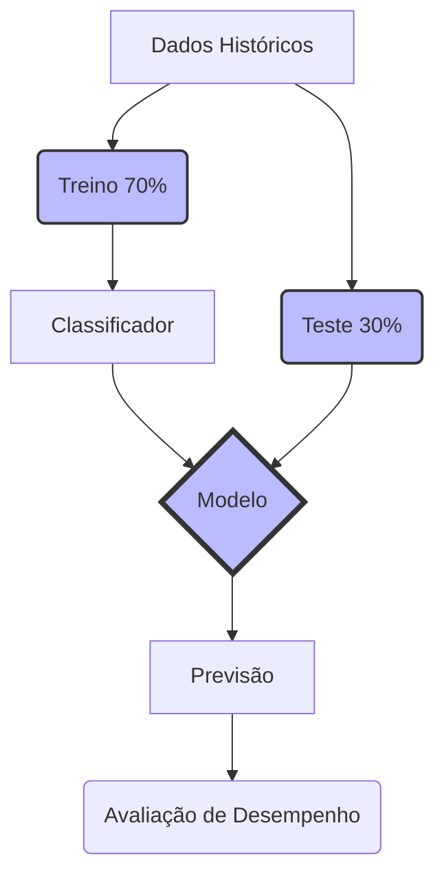
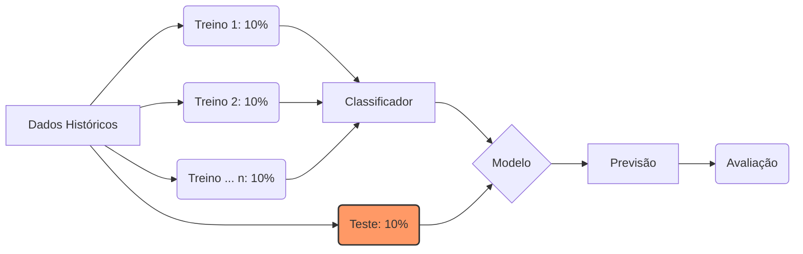

>[!info ] Recapitulando a Classificação
>O nosso grande objetivo com a tarefa de classificar é **prever ou descrever a classe de um evento**. Na nossa estrutura de dados(a tabela), essa classe normalmente é representada por um atributos especial posicionado como a **última coluna**.

Exemplo: Identificar se uma transação é **Fraudulenta ou Legítima**, ou se um e-mail é  **Spam ou Não Spam**.

Mas aqui entra a grande sacada dos Cientistas de Dados: como saber se a IA ficou inteligente de verdade ou se ela só "decorou" a tabela? para **Medir o Desempenho do Modelo**, nós Nunca entregamos todo os nossos dados de uma vez para a máquina. Nós dividimos a nossa tabela original em etapas:

1. **Dados de Treino**: É a maior parte dos dados. O algoritmo processa esse exemplos repetidas vezes para aprender os padrões de **criar o modelo**.(É o momento de "estudar a matéria em casa").
2. **Dados de Validação**: São usados no meio do caminho para ajustar o modelo. (É como fazer um "simulado" para descobrir quais matérias precisam de mais revisão).
3. **Dados de Testes**: É a etapa final! Esses dados são escondidos da IA no início e são usados exclusivamente para **avaliar a performance do modelo** pronto. (É o dia do "vestibular", valendo nota, com questões inéditas!).

>[!warning] Regra
>Se você testar a sua IA usando as exatas mesmas linhas da tabela que usou para treiná-la, ela vai acertar 100% porque decorou as respostas. Por isso, os dados de Teste devem ser sempre inéditos para o modelo!

---
## O "Vestibular" da IA (Técnicas de Validação)

Para garantir que o modelo de Machine Learning não está apenas decorando as respostas, nós precisamos de métodos confiáveis para testá-lo. As técnicas mais famosas são o **Hold-Out** e a **Validação Cruzada**.

### A Técnica Hold-Out (Divisão Simples)

Esta é a abordagem mais direta: você paga seus Dados Históricos e os corta em dois pedaços(Treino e Teste). A proporção clássica é usar **70% para Treino e 30% pra Testes**.

## Validação Cruzada(O Teste de Fogo)

Às vezes, só dividir em 70/30 não é o suficiente, principalmente se tivermos poucos dados. A **Validação Cruzada** resolve isso dividindo os dados em **vários conjuntos menores**

Existem variações dessa técnica:

- **K-Fold**: Divide o conjunto de dados em "k" pedaços(subconjuntos). A IA treina em quase todos(k-1) e faz o teste no pedaço que sobrou. Esse processo é repetido 'k' vezes, para que todos os pedaços tenham a chance de ser o teste pelo menos uma vez!
- **Leave-One-Out**: É um caso extremo onde a IA treina com todos os dados, deixando apena **um único exemplo** de fora para ser o teste.

>[!tip] Dica
>Pense no **Hold-Out** como fazer apenas uma prova final no ano. Já o **K-Fold** é como fazer várias provas ao longo do ano usando partes diferentes da apostila. A média de todas essas provas dá uma visão muito mais real do conhecimento do aluno(ou da IA)

---
## A Síndrome do Estudante (Super Ajuste vs. Sub Ajuste)

>[!success] O Mundo Ideal: A Generalização
>Antes de falarmos dos erros, precisamos saber o que é o acerto. O objetivo de todo classificador é criar modelos genéricos. Um modelo "Genérico Ajustado" é aquele que aprendeu a lógica real do problema e consegue acertar previsões mesmo quando vê dados totalmente novos.

Mas, às vezes, o aprendizado da IA sai dos trilhos. Isso acontece de duas formas principais: o **Super Ajuste**(Overfitting) e  **Sub Ajuste**(Underfitting).

| **Característica**               | **Super Ajuste (Overfitting)**                                                                                                                                                                                                | **Sub Ajuste (Underfitting)**                                                                                                                               |
| -------------------------------- | ----------------------------------------------------------------------------------------------------------------------------------------------------------------------------------------------------------------------------- | ----------------------------------------------------------------------------------------------------------------------------------------------------------- |
| **O que é?                       | É o "Aluno Decorador". Ele decorou as respostas da apostila, mas vai mal na prova real porque não entendeu a matéria.                                                                                                         | É o "Aluno Preguiçoso". Ele não prestou atenção nas aulas e vai mal tanto nos exercícios em casa quanto na prova real.                                      |
| **Desempenho no Treino**         | O modelo super ajustado funciona bem com dados de treino.                                                                                                                                                                     | O modelo de machine learning não consegue se ajustar bem aos dados de treinamento.                                                                          |
| **Desempenho no Teste/Produção** | Tem o desempenho pobre em dados de teste ou de produção.                                                                                                                                                                      | Também não consegue generalizar bem para novos dados.                                                                                                       |
| **Principais Causas**            | - Tamanho insuficiente do conjunto de dados .  - Complexidade excessiva do modelo de treinamento  - Ruído nos dados de treinamento   - Seleção inadequada de atributos  - Falta de validação cruzada. | - Modelo muito simples .  - Conjunto de dados muito pequeno .  - Seleção inadequada de atributos .  - Falta de ajuste de hiperparâmetros. |
> [!danger] Alerta
> Perceba que tanto a "seleção inadequada de atributos"(escolher as colunas erradas da tabela) quanto ter poucos dados poder causar os dois tipos de problemas! Por isso a fase de preparação dos dados é tão vital.

