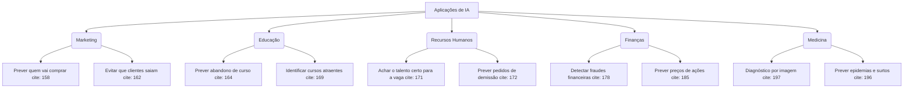

### Áreas de Atuação

A IA é como um "canivete suíço" tecnológico, aplicada em diversas áreas:
- `Saúde`: Diagnósticos e novos remédios
- `Segurança`: Detecção de fraude e crimes digitais
- `Comunicação`: Reconhecimento de fala e tradução de texto
- `Entreterimento`: Sistemas que recomendam o que você deve assistir ou comprar.

### Oportunidades por Setor

### Destaques Importantes

-  **Análise de Chrun**: Temo usado para identificar quando um cliente ou aluno pretende abandonar um serviço.  A IA avisa  a empresa antes disso acontecer para que ela possa agir.
- **Medicina de Precisão**: A Ia consegue analisar exames de imagem(como tomografias) e identificar anomalias minúsculas que o olho humano poderia deixar passar.
- **Personalização Financeira**: Bancos usam IA para analisar risco de cŕ