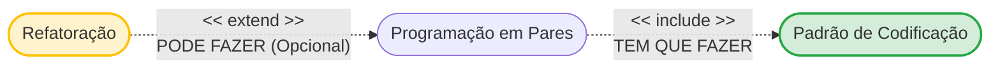
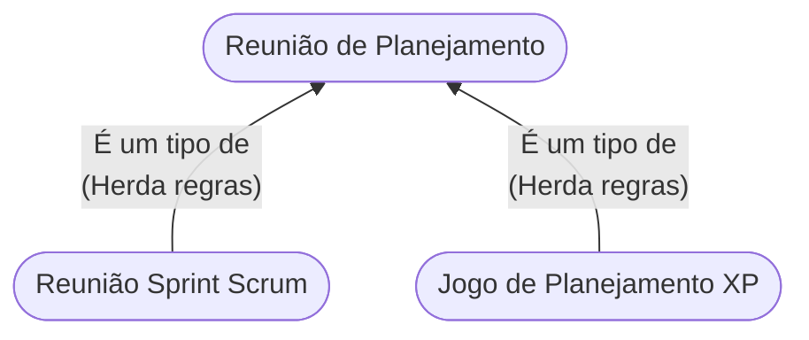

Casos de uso são uma técnica para captar os requisitos funcionais de um sistema. O diagrama de casos de uso a seguir descreve as interações entre os usuários e o sistema, possibilitando aos analistas e clientes entenderem como o sistema será utilizado.

*Com base no diagrama de casos de uso mostrado na figura e elaborado a partir da notação Unified Modeling Language (UML), considere as afirmativas a seguir.*

I  →  O time deve aplicar as práticas de refatoração e padrão de codificação durante a programação em pares.  
II  → A prática Planning Poker é opcional e pode ser usada em qualquer tipo de reunião de planejamento.  
III  →  O uso de um relacionamento de generalização/especialização possibilita que as interações comuns sejam compartilhadas, promovendo o reúso.  
IV  →  A associação do ator Product Owner poderia ser com o caso de uso Reunião de Planejamento, não gerando impacto no comportamento do sistema.

A) apenas I e II.

B) apenas I e IV.

C) apenas II e III.

D) apenas III e IV. 

E) apenas I, II e III.

>[!success] Alternativa Correta : C

---

Antes de olhar as alternativas, cole essa regra:

- `<<include>>`(**inclusão**): **É OBRIGATÓRIO.** É como comprar um carro zero: ele inclui pneus. Não tem como levar o carro sem os pneus. A seta sai do caso de uso principal e aponta para o incluído.
- `<<extend>>`**(Extensão): É OPCIONAL (ou condicional)**. É o teto solar do carro. carro funciona sem ele, você só adiciona se quiser ou sob certa condição. A seta sai do caso de uso opcional e aponta para o principal.

I → O time deve aplicar as práticas de refatoração e padrão de codificação durante a programação em pares. (FALSA)

"Programação em Pares" tem um `<<include>>` para "Padrão de Codificação"(então o time deve aplicar o padrão). Porém, ela tem um `<<extend>>` vindo de "Refatoração". Ou seja, refatorar é **opcional.** O time pode aplicar refatoração, não deve obrigatoriamente.

II → A prática Planning Poker é opcional e pode ser usada em qualquer tipo de reunião de planejamento. (VERDADEIRA)

Pode ser usada em qualquer tipo? Sim! Por causa do triângulo branco (Generalização/Herança). A Reunião Scrum e o Jogo XP "herdam" tudo da Reunião de Planejamento genérica. Logo, se o "pai" aceita Planning Poker opcionalmente, os "filhos" também aceita.

III → O uso de um relacionamento de generalização/especialização possibilita que as interações comuns sejam compartilhadas, promovendo o reúso. (VERDADEIRA)

Essa é a definição acadêmica de Herança(a seta com ponta de triângulo vazada). Em vez de desenhar a seta do "Time" e a seta do "Planning Poker" duas vezes (uma para scrum e outra para XP), você coloca no "pai" e a reaproveita.

IV → A associação do ator Product Owner poderia ser com o caso de uso Reunião de Planejamento, não gerando impacto no comportamento do sistema. (FALSA)

Impacta totalmente! No desenho atual, o Product Owner(PO) está ligado apenas à "Reunião de Planejamento da Sprint(Scrum)". Se você subir o bonequinho do PO e ligá-lo ao balão principal de cima ("Reunião de Planejamento"), por causa da herança, o PO passaria a participar do "Jogo do Planejamento(XP)" também. isso muda a regra de negócio do sistema.