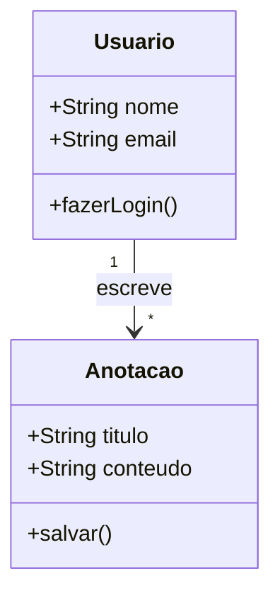
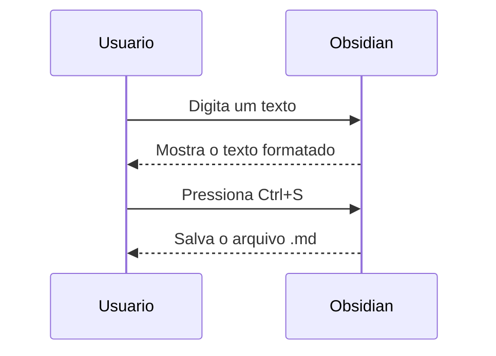
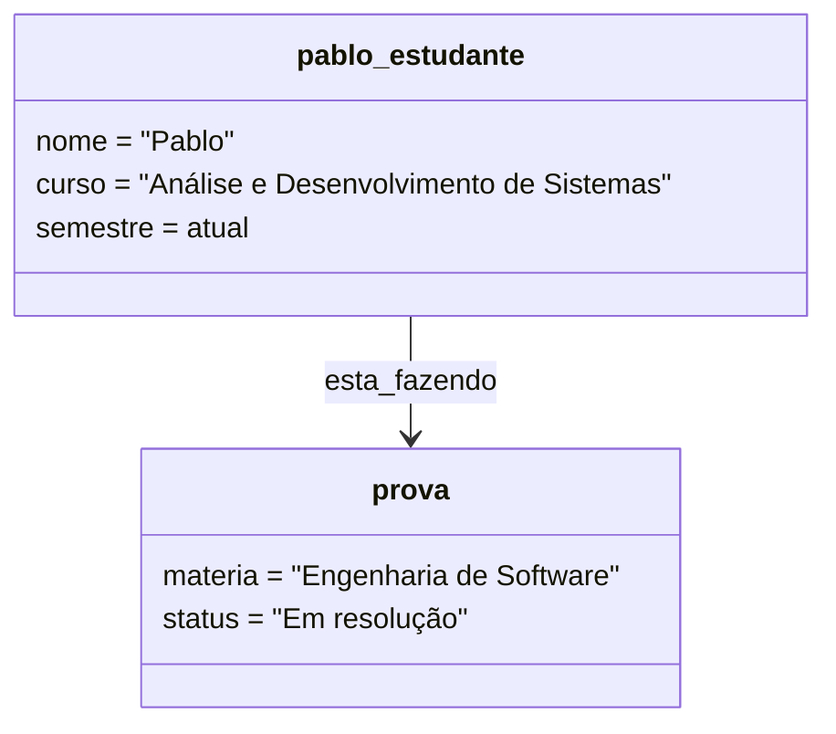
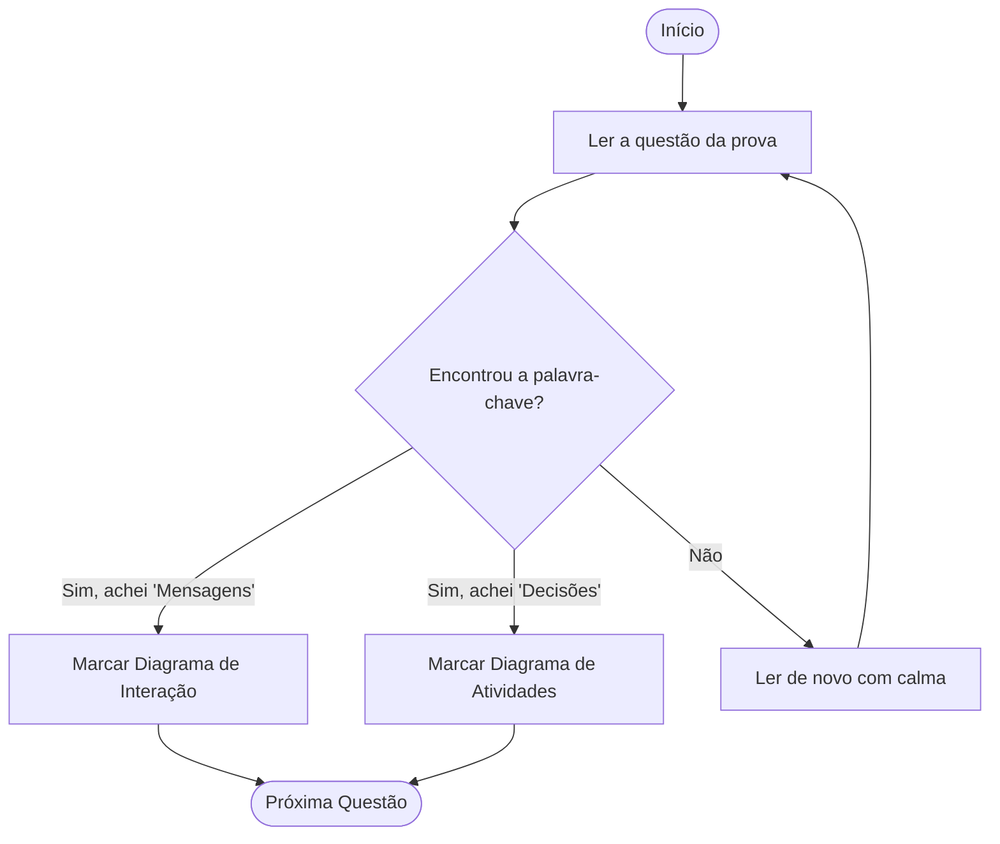

Um processo de desenvolvimento de software que utilize a UML como linguagem de suporte à modelagem envolve a criação de diversos documentos, os quais podem ser textuais ou gráficos e são chamados de artefatos. Os artefatos gráficos podem ser definidos por meio de diagramas UML (Unified Modeling Language). A partir disso, observe os objetivos a seguir.  
  
A - Descrever os tipos de objetos presentes no sistema e os vários tipos de relacionamentos estáticos existentes entre eles.  
B - Representar como grupos de objetos colaboram em algum comportamento, isto é, as mensagens trocadas entre os objetos.  
C - Exibir uma “fotografia” do sistema em certo momento, demonstrando as ligações formadas entre objetos conforme interagem e de acordo com os valores dos seus atributos.  
D - Mostrar as ações e decisões que ocorrem enquanto uma dada função é executada.

A) A - Diagrama de Classes; B - Diagrama de Interação; C - Diagrama de Objetos; D - Diagrama de Atividades.

B) A - Diagrama de Classes; B - Diagrama de Atividades; C - Diagrama de Objetos; D - Diagrama de Interação.

C ) A - Diagrama de Objetos; B - Diagrama de Interação; C - Diagrama de Instâncias; D - Diagrama de Atividades.

D ) A - Diagrama de Classes; B - Diagrama de Interação; C - Diagrama de Objetos; D - Diagrama de Estados.

E) A - Diagrama de Objetos; B - Diagrama de Estados; C - Diagrama de Instâncias; D - Diagrama de Interação.

>[!success] Alternativa Correta: A

---

##  A - Diagrama de Classes

"Descrever os tipos de objetos presentes no sistema e os vários tipos de relacionamentos estáticos existentes entre eles."

Pensa no Diagrama de Classes como a **planta baixa de uma casa**. Ele não mostra as pessoas andando pela casa(isso seria dinâmico), ele mostra apenas a estrutura fixa: onde estão as paredes, quais são os cômodos e como eles se conectam. A palavra-chave aqui é "estático". Ele dita as regras do que o sistema tem, mas não o que ele faz no tempo.

---
## B -  Diagrama de Interação

"Representar como grupos de objetos colaboram em algum comportamento, isto é, as mensagens trocadas entre os objetos. "

Um diagrama de interação(que engloba o famoso Diagrama de Sequência) é como o **roteiro de uma peça de teatro**. Ele foca puramente no diálogo. Ele diz: "O Objeto A falou com Objeto B, que então respondeu para o Objeto A".

A palavra-chave absoluta aqui é **"mensagens trocadas"**. Se falou de enviar mensagem de um para o outro, é interação.

---
## C - Diagrama de Objetos

"Exibir uma “fotografia” do sistema em certo momento, demonstrando as ligações formadas entre objetos conforme interagem e de acordo com os valores dos seus atributos.  "

Se a Classe é a "planta da casa", o Objeto é uma **foto polaroid tirada dentro da casa em um dia específico**. Ele pega aquela estrutura genérica (Classe) e preenche com dados reais do momento. A palavra-chave sempre será **"fotografia"** ou **"estados em uma momento específico"**

- - - 
## D - Diagrama de Atividades

"Mostrar as ações e decisões que ocorrem enquanto uma dada função é executada."

O diagrama de atividade é basicamente o bom e velho fluxograma. Ele mostra um passo a passo, como uma receita de bolo "faça isso -> se acontecer x, vá para a direita -> senão, vá para a esquerda." a palavra chave é **"ações e decisões"** ou "**fluxo**"

-  **Estático / Estrutura / Tipos**: Diagrama de Classes
- **Mensagens / Comunicação**: Diagrama de interação (Sequência/ Comunicação)
- **Fotografia/ Momento/ Valores**: Diagrama de Objetos
- **Decisões/ Ações/ Passo a Passo**: Diagrama de Atividades