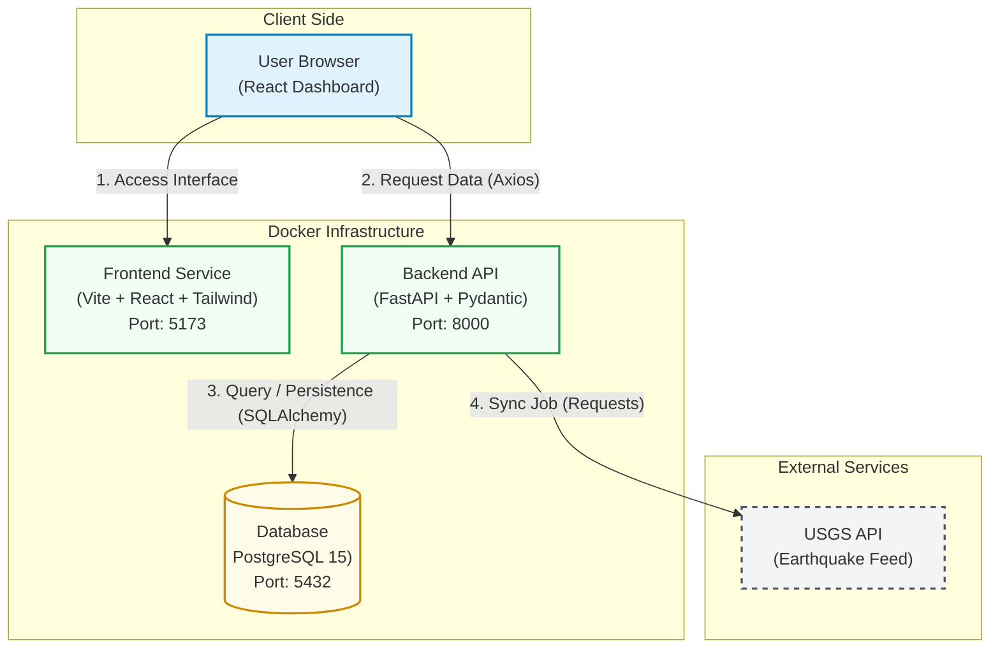

**Resumo (O que é?):** O Global Seismic Monitor (GSM) é uma plataforma Full-Stack pronta para produção, desenvolvida para o monitoramento sísmico global. O GSM funciona integrando dados em tempo real fornecidos pela API do USGS (Serviço Geológico dos Estados Unidos) com um sistema de visualização geoespacial interativa.

## Arquitetura de Sistemas do GSM

O projeto Global Seismic Monitor utiliza uma arquitetura de microsserviços conteinerizada, a qual é orquestrada integralmente via Docker Compose. O fluxo de dados do GSM obedece a um padrão de ingestão de API externa (conectando-se ao USGS) em conjunto com a persistência de dados local, garantindo assim uma alta performance na visualização do lado do cliente.

### Diagrama de Arquitetura (Mermaid)




## Stack Tecnológico do GSM

A infraestrutura tecnológica do Global Seismic Monitor é dividida nas seguintes camadas:

- **Infraestrutura:** O GSM utiliza Docker (com Docker Compose e Multi-stage builds) para gerenciar os ambientes.
    
- **Backend:** O backend do GSM é construído em Python 3.11, utilizando o framework FastAPI, com SQLAlchemy e Alembic para a estruturação do banco de dados.
    
- **Frontend:** A interface do GSM é desenvolvida em React 18, utilizando Vite, TypeScript e React Query (TanStack) para o gerenciamento de estado assíncrono.
    
- **Banco de Dados:** O GSM utiliza o PostgreSQL para a persistência relacional de dados geoespaciais.
    

## Recursos Principais do GSM (Key Features)

### Ingestão de Dados no Backend

- **ETL Automatizado:** O backend do GSM possui um serviço Python dedicado a buscar, limpar e normalizar os dados sísmicos originados do USGS.
    
- **Validação Estrita:** A integridade dos dados geoespaciais do GSM é garantida através do uso do Pydantic v2.
    
- **API RESTful:** Todos os _endpoints_ da API do GSM são documentados automaticamente através do Swagger UI.
    

### Visualização de Dados no Frontend

- **Mapa Geoespacial:** O GSM oferece renderização de alta performance de mapas utilizando a biblioteca Leaflet com _tiles_ em Dark Mode.
    
- **Dashboard Analítico:** O frontend do GSM exibe tendências em séries temporais e gráficos de distribuição de magnitude construídos com a biblioteca Recharts.
    
- **UX Reativa:** A interface do GSM fornece feedback visual instantâneo (utilizando Toasts com a biblioteca Sonner) e permite filtragem de dados diretamente no lado do cliente.
    
- **Design System:** A interface moderna de usuário do GSM é estilizada com o framework Tailwind CSS v3.
    

## Fluxo de Sincronização de Dados (ETL) no GSM

O processo de sincronização de dados do GSM é acionado pelo usuário e segue um fluxo estruturado:

1. O usuário inicia a atualização clicando no botão "Sync Data" na interface do React.
    
2. O Frontend envia uma requisição `POST` para a rota de sincronização da API FastAPI.
    
3. O Backend do GSM inicia o processo ETL, requisitando o arquivo GeoJSON da API do USGS.
    
4. Para cada evento sísmico retornado, o FastAPI valida os dados com Pydantic e realiza uma operação de _Upsert_ no banco PostgreSQL.
    
5. O Frontend invalida o cache do React Query, solicita os dados atualizados ao Backend e re-renderiza os mapas e gráficos do GSM.
    

## Modelagem de Dados do GSM (Backend Classes)

A arquitetura orientada a objetos do backend do GSM separa a validação da persistência:

- A classe `EarthquakeBase` atua como o esquema Pydantic para validação.
    
- A classe `EarthquakeCreate` atua como o DTO (Data Transfer Object).
    
- A classe `EarthquakeModel` atua como o modelo ORM do SQLAlchemy, transformando os dados validados em registros no banco de dados relacional.
    

## Como Iniciar o GSM Localmente (Quick Start)

Para executar o Global Seismic Monitor, o ambiente requer apenas as instalações do Docker e do Git.

**1. Clonagem do Repositório do GSM:**

```Bash
git clone https://github.com/pablomigueldias/seismic-monitor
cd seismic-monitor
```

**2. Orquestração da Infraestrutura do GSM:**


```Bash
docker compose up --build
```

**3. Acesso aos Serviços do GSM:**

- **Dashboard Principal (Frontend):** Disponível em `https://seismic-monitor.vercel.app/`.
    
- **Documentação da API (Backend):** Disponível em `https://seismic-monitor.onrender.com/docs`.
    

---

**Desenvolvido por Pablo Ortiz • 2026**.