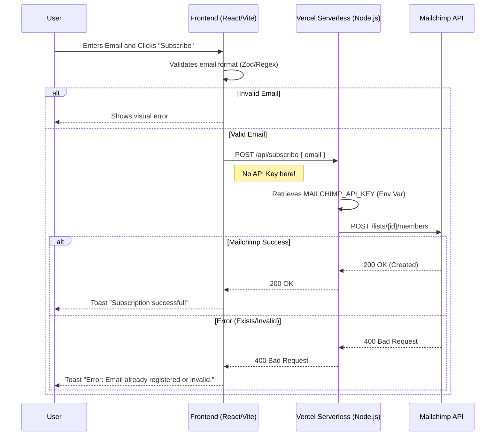

**Resumo (O que é?):** O projeto Newsletter Lead Capture é uma implementação Full-Stack de um sistema de captura de leads. O Newsletter Lead Capture tem como objetivo demonstrar uma arquitetura de software segura em conjunto com práticas modernas de desenvolvimento web.

**Acesso (Live Demo):**

- **Deploy:** Hospedado online na Vercel ([Acessar Projeto Newsletter](https://newsletter-project-ten.vercel.app/)).
    

## Stack Tecnológico do Newsletter Lead Capture

A infraestrutura tecnológica do projeto Newsletter Lead Capture é dividida nas seguintes tecnologias:

- **Frontend:** O Frontend do Newsletter Lead Capture utiliza React 19, TypeScript, Vite e Tailwind CSS v4.
    
- **Backend:** O Backend do sistema opera com Node.js, executado através de Vercel Serverless Functions.
    
- **Integração Externa:** O sistema de captura integra-se diretamente com a Mailchimp Marketing API.
    
- **Validação de Dados:** A validação de esquemas (_Schema Validation_) é realizada rigorosamente pela biblioteca Zod, atuando de forma espelhada tanto no Frontend quanto no Backend.
    
- **DevOps e Infraestrutura:** A esteira de _deploy_ utiliza CI/CD através da Vercel, enquanto o Docker é empregado para garantir a consistência do ambiente de desenvolvimento.
    

## Fluxo de Aplicação e Arquitetura BFF

O fluxo de dados do Newsletter Lead Capture ilustra o uso prático do padrão arquitetural **BFF (Backend for Frontend)**, que foi implementado especificamente para proteger as credenciais e chaves da API.

**Descrição Textual do Fluxo de Sincronização:**

1. O Usuário insere o seu email na interface e clica no botão de inscrição ("Subscribe").
    
2. O Frontend (React/Vite) realiza a validação primária do formato do email utilizando a biblioteca Zod e Expressões Regulares (Regex).
    
    - Se o email for inválido, o Frontend exibe um erro visual imediato para o usuário.
        
3. Se o email for válido, o Frontend envia uma requisição `POST` contendo o _payload_ `{ email }` para a rota `/api/subscribe` do Serverless. _Nota arquitetural: Nenhuma API Key é exposta ou enviada nesta etapa do Frontend._.
    
4. O Backend (Vercel Serverless com Node.js) recupera a variável de ambiente `MAILCHIMP_API_KEY` guardada com segurança no servidor.
    
5. O Backend repassa a requisição `POST` para a rota `/lists/{id}/members` da API do Mailchimp.
    
6. O sistema processa a resposta do Mailchimp:
    
    - **Em caso de Sucesso:** O Mailchimp retorna o status `200 OK (Created)`, o Backend repassa o sucesso para o Frontend, e a interface exibe um Toast com a mensagem "Subscription successful!".
        
    - **Em caso de Erro (Email já registrado ou inválido):** O Mailchimp retorna `400 Bad Request`, o Backend repassa o erro para o Frontend, e a interface exibe um Toast de alerta notificando a falha.
        

### Diagrama de Sequência (Mermaid)




## Decisões de Engenharia e Arquitetura

### Segurança de API Key (Padrão BFF)

A arquitetura do Newsletter Lead Capture evita chamar a API do Mailchimp diretamente pelo Frontend, pois essa prática comprometeria a segurança ao expor credenciais sensíveis no navegador do cliente. A decisão arquitetural foi utilizar Serverless Functions como um _middleware_ seguro. O fluxo de requisição transita do Cliente para a Next.js API (realizando a validação e autenticação) e, em seguida, para os servidores do Mailchimp. Esta abordagem garante categoricamente que a variável `MAILCHIMP_API_KEY` nunca saia do ambiente seguro protegido do servidor.

### Dupla Validação de Dados (Zod)

A integridade sistêmica no Newsletter Lead Capture é assegurada através de um modelo de dupla validação:

- **Validação no Client-side:** Fornece _feedback_ visual e instantâneo para melhorar a experiência do usuário durante a digitação.
    
- **Validação no Server-side:** Fornece a barreira de segurança primária contra requisições maliciosas ou tentativas de burlar as regras do frontend.
    

### Estilização com Tailwind CSS v4

O projeto adota a versão mais recente do framework (v4) com o objetivo de obter otimização de performance através do motor Lightning CSS, resultando em uma redução significativa do tempo de compilação (build).

## Como Iniciar o Newsletter Lead Capture Localmente

Para executar o ambiente de desenvolvimento, a máquina deve possuir o Node.js 20 (ou versão superior) instalado e uma conta válida no Mailchimp (com acesso à API Key e ao Audience ID).

**Passos de Instalação:**


```Bash
# 1. Clonar o repositório oficial do projeto
git clone https://github.com/your-username/newsletter-portfolio.git

# 2. Instalar as dependências do ecossistema Node
npm install

# 3. Configurar as Variáveis de Ambiente locais
cp .env.example .env
# O desenvolvedor deve preencher as variáveis no arquivo .env: MAILCHIMP_API_KEY, MAILCHIMP_LIST_ID, MAILCHIMP_DATACENTER

# 4. Iniciar o servidor de desenvolvimento
npm run dev
```