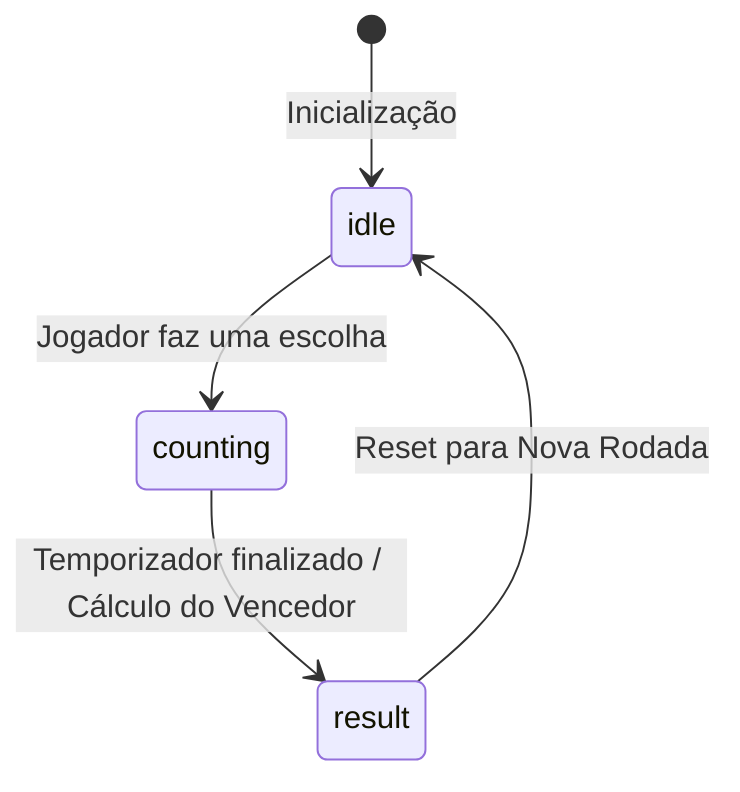

**Resumo (O que é?):** O projeto RPS Arena - Jokenpo Pro é um WebApp moderno do clássico jogo Pedra, Papel e Tesoura. O RPS Arena - Jokenpo Pro foi desenvolvido com foco em performance, arquitetura limpa e experiência do usuário (UX), adotando uma estética Gamer e Neon. Este sistema foi construído como parte de um estudo aprofundado sobre desenvolvimento Frontend Moderno e Lógica de Sistemas, visando implementar padrões profissionais de desenvolvimento.

**Acesso (Live Demo):**

- **Deploy:** Hospedado online na Vercel ([Acessar Projeto RPS Arena](https://jokenpo-pro.vercel.app/)).
    
## Funcionalidades Principais do RPS Arena

- **UI/UX Imersiva:** O RPS Arena - Jokenpo Pro apresenta um design no estilo "Neon Cyberpunk", incorporando efeitos de _glassmorphism_ (vidro), brilho externo (_glow_) e animações suaves na interface.
    
- **Placar Persistente:** O sistema de _Score_ do RPS Arena - Jokenpo Pro é persistente e atualizado em tempo real conforme o resultado das rodadas disputadas.
    
- **Lógica Robusta de Jogo:** O algoritmo do RPS Arena - Jokenpo Pro gera escolhas aleatórias para a CPU e determina o vencedor da rodada de forma instantânea.
    
- **Modal Interativo de Regras:** O projeto inclui uma janela de modal interativa com controle de visibilidade para a consulta rápida das regras do jogo.
    
- **Responsividade Total:** O layout do RPS Arena - Jokenpo Pro é totalmente adaptável, empilhando elementos verticalmente em telas pequenas e expandindo a visualização em monitores largos.
    

## Tecnologias e Decisões de Engenharia

### React e Hooks Avançados

O desenvolvimento do RPS Arena - Jokenpo Pro utilizou o ecossistema React com manipulação de Hooks complexos:

- O hook `useState` é responsável pelo gerenciamento de estado do placar e da interface do usuário.
    
- O hook `useEffect` controla o ciclo de vida do jogo, gerenciando o _timer_ da contagem regressiva e a lógica condicional de vitória.
    
- O hook `useRef` foi aplicado como uma solução de engenharia estrutural para evitar a "Double Invocation" (dupla invocação) característica do React 18 Strict Mode, garantindo assim que a pontuação do jogo não fosse duplicada em ambientes de desenvolvimento.
    

### Tailwind CSS v4 e Mobile First

A estilização do RPS Arena - Jokenpo Pro utiliza a versão v4 do Tailwind CSS, explorando o uso de variáveis nativas de CSS (`@theme`) para dispensar ferramentas pré-processadoras como o Sass. O design seguiu o padrão _Mobile First_, sendo desenvolvido prioritariamente para dispositivos móveis, com adaptação fluida para desktops através de Flexbox e _Breakpoints_ nativos do Tailwind.

### Arquitetura de Máquina de Estados (State Machine)

O fluxo de renderização e jogo do RPS Arena - Jokenpo Pro não é construído de forma linear; o sistema opera arquiteturalmente como uma State Machine (Máquina de Estados). O gerenciamento transita entre três estados fundamentais: `idle` (ocioso), `counting` (contagem regressiva) e `result` (resultado final). Esta arquitetura garante previsibilidade no fluxo e facilita o processo de testes lógicos.

