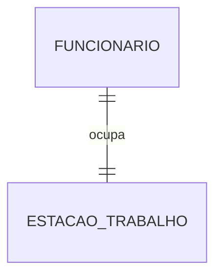
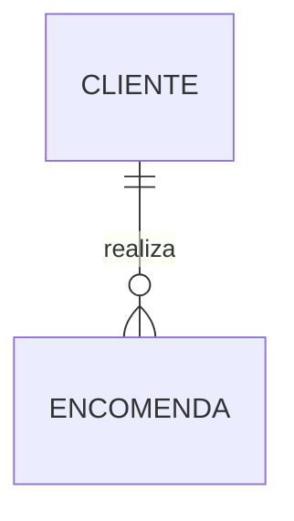
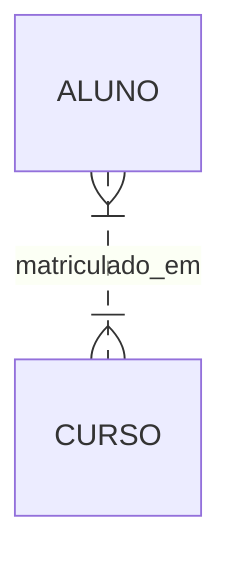
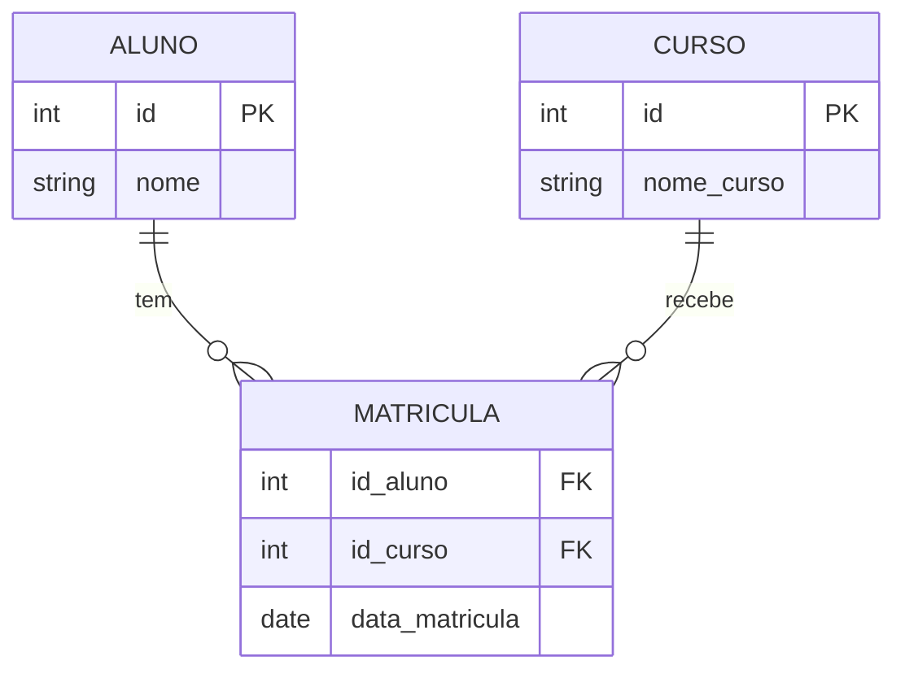

Quando estamos desenhando um sistema, as setas que ligam as caixinhas no diagrama importam tanto quanto as caixinhas em si. Essas conexões definem a **Cardinalidade**.

A cardinalidade diz respeito ao número de itens que se relacionam nas entidades. Em termos simples: "Quantos desse lado se conectam com quantos daquele lado?".

Hoje vamos traduzir a notação clássica de Peter Chen para o mundo real do desenvolvimento de software.

### Máxima vs. Mínima: O Detalhe que Importa

Muitos devs só se preocupam com o "Muitos" (N), mas esquecem do "Zero" (0). A cardinalidade se divide em duas:

1. **Cardinalidade Máxima:** O teto. É o número máximo de instâncias que _podem_ participar. Geralmente é **1** ou **N** (Muitos).
    
2. **Cardinalidade Mínima:** O piso. É o número mínimo de instâncias que _devem_ participar.
    
    - **Zero (0):** Participação Opcional (o registro pode existir sozinho).
        
    - **Um (1):** Participação Obrigatória (o registro precisa do outro para existir).
        

> **Exemplo Real:** Um **Cliente** pode fazer **Muitas** compras (Máxima: N), mas pode se cadastrar e não comprar nada (Mínima: 0). Uma **Compra**, porém, _deve_ ter obrigatoriamente **Um** cliente (Mínima: 1).

---

### Os Três Tipos de Relacionamento Binário

Vamos visualizar isso e entender a lógica por trás.

#### 1. Um-para-Um (1:1)

Uma instância de uma entidade se relaciona com _apenas uma_ instância da outra.

**Cenário:** `Funcionário` e `Estação de Trabalho` (Supondo que cada funcionário tem sua mesa exclusiva e vice-versa).

- **Uso Prático:** Raro. Geralmente usamos para separar dados sensíveis (ex: tabela `Usuarios` e tabela `Dados_Bancarios_Usuarios`) ou para particionamento vertical de tabelas gigantes.
    

#### 2. Um-para-Muitos (1:N)

O "feijão com arroz". Uma instância de um lado se relaciona com várias do outro.

**Cenário:** `Cliente` e `Encomenda`. Um cliente faz várias encomendas. Uma encomenda pertence a um só cliente.

- **No Banco (SQL):** A Chave Primária (PK) do lado "1" vai para o lado "N" como Chave Estrangeira (FK).
    
    - A tabela `Encomenda` ganha uma coluna `id_cliente`.
        

#### 3. Muitos-para-Muitos (N:M)

Onde o filho chora e a mãe não vê. Muitas instâncias de um lado se relacionam com muitas do outro.

**Cenário:** `Aluno` e `Curso`. Um aluno se matricula em vários cursos. Um curso tem vários alunos matriculados.

### O Problema do N:M (E a Solução)

**Bancos de dados relacionais NÃO suportam relacionamentos N:M diretamente.** Você não pode colocar uma lista de IDs dentro de uma célula (viola a 1ª Forma Normal).

Para implementar um N:M, precisamos **desmembrar o relacionamento**.

Criamos uma **Entidade Associativa** (ou Tabela de Junção/Pivot Table) que fica no meio. O relacionamento N:M se transforma em **dois relacionamentos 1:N**.

**A Transformação:** De: `Aluno <--> Curso` Para: `Aluno <-- Matricula --> Curso`

Observe a tabela `MATRICULA`. Ela contém a FK do Aluno e a FK do Curso. É assim que conectamos "Muitos com Muitos" no mundo real.

### Simbologia: Peter Chen vs. O Mundo

Nos livros acadêmicos e nas suas anotações, você verá a notação de **Peter Chen** (losangos para relacionamentos, linhas com "1" e "N"). Ela é excelente para o modelo conceitual.

Porém, ferramentas modernas usam a notação **Pé de Galinha (Crow's Foot)**.

- O "garfo" (tridente) significa **N** (Muitos).
    
- O traço perpendicular significa **1**.
    
- A bolinha significa **0** (Opcional).
    

### Conclusão

Entender cardinalidade evita bugs lógicos graves. Se você modelar um relacionamento 1:1 quando deveria ser 1:N, seu sistema vai falhar na segunda inserção de dados. Se tentar fazer N:M sem tabela associativa, vai violar a normalização.

Antes de criar a tabela, desenhe a linha. Pergunte: "É um ou são vários?". Essa pergunta economiza horas de refatoração.