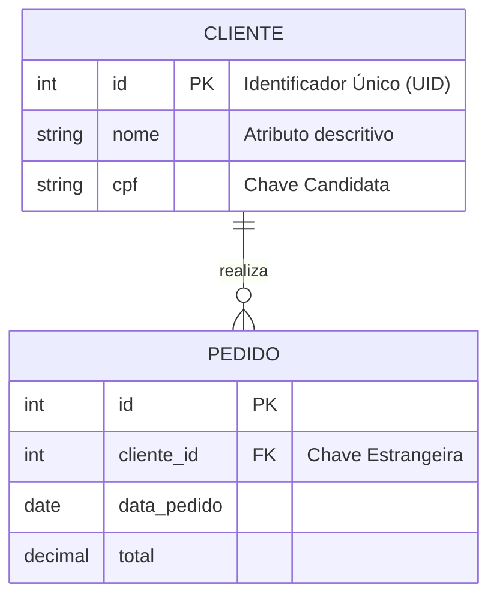

Em um mundo hypado por "NoSQL" e "Graph Databases", é fácil esquecer quem carrega o piano nas grandes empresas. O **Modelo Relacional** não é apenas uma forma de guardar dados; é uma aplicação elegante de **Lógica e Teoria de Conjuntos** para garantir a integridade da informação.

Hoje, vamos revisitar os princípios propostos por E.F. Codd em 1970 e entender como transformar conceitos abstratos em estruturas físicas à prova de falhas.

### O Que é, de Fato, um Modelo?

Antes de falarmos de SQL, precisamos definir o conceito. Um modelo é uma estrutura que ajuda a comunicar conceitos que estão na mente do projetista. Ele serve para descrever, analisar e especificar ideias com detalhes suficientes para que um desenvolvedor consiga construir o banco.

No contexto de dados, o modelo fornece a estrutura, as definições e os formatos específicos.

> **Curiosidade Histórica:** Antes do Relacional, usávamos modelos Hierárquicos e de Rede. Imagine a dor de cabeça de navegar em ponteiros físicos para achar um registro. O Modelo Relacional abstraiu isso organizando dados em coleções de tabelas bidimensionais.

---

### A Anatomia de uma Relação (Tabela)

No modelo relacional, o que chamamos popularmente de "Tabela" é tecnicamente uma **Relação**. Ela é a estrutura básica de armazenamento e deve representar algo do mundo real (como Clientes ou Pedidos).

Vamos dissecar seus componentes:

#### 1. Tupla (Linha)

A Tupla representa uma ocorrência única de uma entidade.

- Exemplo: Os dados completos do cliente "Pablo".
    
- **Regra de Ouro:** Não pode haver linhas duplicadas. Cada tupla deve ser identificável exclusivamente.
    

#### 2. Atributo (Coluna)

É a unidade que armazena um tipo específico de dado.

- Exemplo: O atributo `telefone` ou `preço`.
    
- Atributos podem ser obrigatórios (NOT NULL) ou opcionais.
    

#### 3. Chaves (O Coração da Integridade)

Sem chaves, temos apenas uma planilha desorganizada.

- **Chave Primária (PK):** É o atributo (ou conjunto deles) que identifica um registro de forma exclusiva. Ex: `CPF` ou `ID_Cliente`.
    
- **Chave Estrangeira (FK):** É o que cria o "Relacional" no nome. Ela define como as tabelas conversam, referenciando uma PK de outra tabela.
    

---

### Do Requisito ao Diagrama

Como saímos de uma reunião com o cliente para o código? Através da **Análise de Requisitos** e do **MER (Modelo Entidade-Relacionamento)**.

1. **Análise:** Coletamos informações e definimos os processos de negócio.
    
2. **MER:** Criamos um diagrama ilustrando as Entidades (algo significativo sobre o qual queremos informações) e seus Relacionamentos (associações nomeadas).

Imagine que identificamos que "Um Cliente realiza Pedidos". Veja como isso se traduz:

### Cardinalidade e Convenções

Ao modelar, precisamos definir as regras do jogo, chamadas de **Cardinalidade**:

- Um a Um (1:1)
    
- Um para Muitos (1:N) - _O mais comum!_
    
- Muitos para Muitos (N:N)
    

Para manter a sanidade mental, seguimos convenções: Entidades com nomes únicos e singulares (ex: `CLIENTE`, não `CLIENTES`) e atributos em caixa baixa.

### Conclusão

O Modelo Relacional sobrevive há mais de 50 anos porque ele é baseado em **matemática**, não em tendência. Ele garante precisão, consistência e integridade. Entender Tuplas, PKs e FKs não é "coisa de iniciante", é o superpoder que permite você escalar sistemas complexos sem perder dados no caminho.