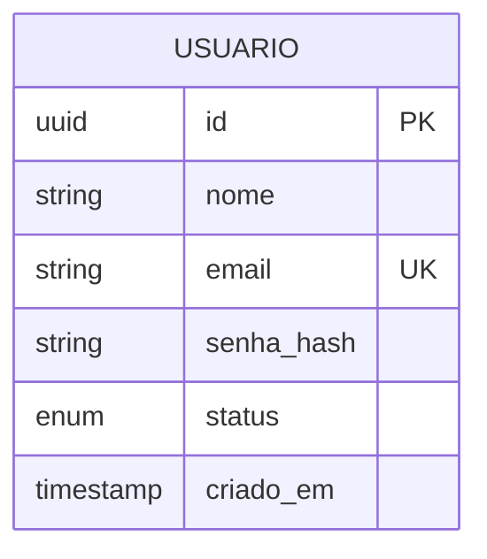

## O Mapa da Mina: Por que você precisa de um Dicionário de Dados

Você já pegou um projeto legado onde uma coluna se chamava `status` e os valores eram `1`, `2`, `99` e ninguém sabia o que significavam? Se sim, você sentiu na pele a falta de um **Dicionário de Dados**.

Enquanto o **DER (Diagrama Entidade-Relacionamento)** é a planta baixa visual, o Dicionário de Dados é o manual técnico detalhado. Ele é um documento (ou repositório) que armazena informações sobre o conteúdo, formato e a estrutura do banco, limitando erros na hora de "codar" a estrutura física (DDL).

Também conhecido como **Repositório de Metadados**, ele responde às perguntas que o diagrama não consegue.

### O que compõe um Dicionário de Dados?

Não basta listar tabelas. Um bom dicionário deve ser detalhado o suficiente para que qualquer DBA ou Backend Dev consiga dar manutenção sem precisar perguntar para o autor do código.

#### 1. Tabelas (Entidades)

Descrição do propósito da tabela.

- **Exemplo:** Tabela `tb_pedidos` - Armazena o cabeçalho das transações de venda realizadas no e-commerce.

#### 2. Atributos (Colunas)

Aqui é onde a mágica acontece. Para cada campo, definimos:

- **Nome Físico:** O nome no banco (`dt_nascimento`).

- **Tipo de Dado:** O tipo primitivo (`DATE`, `VARCHAR`, `INT`).

- **Tamanho/Precisão:** (`100`, `10,2`).

- **Obrigatoriedade:** (`NOT NULL` ou `NULL`).

- **Chaves:** Se é PK (Primary Key) ou FK (Foreign Key).

- **Descrição/Domínio:** O que aquele dado representa e regras de negócio (Ex: "Apenas maiores de 18 anos").

#### 3. Relacionamentos

Explicação das regras de integridade referencial.

- "Um Pedido DEVE pertencer a um Cliente."

- "Um Cliente PODE ter N Pedidos."

---

### Exemplo Prático: Documentando uma Tabela de Usuários.

Imagine que temos este modelo visual:

Dicionário de Dados: Tabela `usuarios`

| **Atributo** | **Tipo de Dado** | **Tam.** | **Constraint**   | **Descrição / Regra de Negócio**                               |
| ------------ | ---------------- | -------- | ---------------- | -------------------------------------------------------------- |
| `id`         | UUID             | -        | **PK**           | Identificador único gerado automaticamente (v4).               |
| `nome`       | VARCHAR          | 150      | NOT NULL         | Nome completo do usuário.                                      |
| `email`      | VARCHAR          | 255      | **UK**, NOT NULL | Email para login. Deve ser único no sistema.                   |
| `senha_hash` | VARCHAR          | 255      | NOT NULL         | Hash da senha (Argon2 ou Bcrypt). Nunca salvar em texto plano. |
| `status`     | CHAR             | 1        | NOT NULL         | `A`=Ativo, `I`=Inativo, `B`=Bloqueado. Default: `A`.           |
| `criado_em`  | TIMESTAMP        | -        | DEFAULT NOW()    | Data e hora do cadastro.                                       |

**Insight:** Note a coluna `status`. Sem o dicionário, um dev novo não saberia que `B` significa "Bloqueado". Documentar "números mágicos" ou siglas é a função mais nobre deste documento.

### Conclusão

Manter um Dicionário de Dados atualizado parece burocracia, mas é **investimento**. Ele reduz o tempo de _onboarding_ de novos devs e evita que regras de negócio se percam quando a equipe muda.

Antes de criar a tabela com `CREATE TABLE`, escreva o dicionário. Se você não consegue descrever o dado no papel, ele não está pronto para ir para o banco.