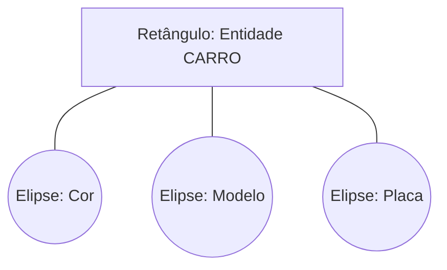
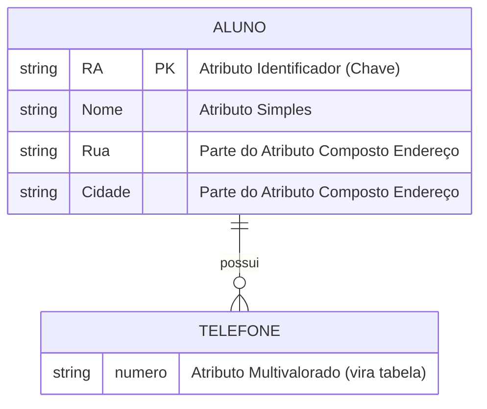

Se as Entidades são os "substantivos" do nosso banco de dados (Cliente, Produto, Pedido), os **Atributos** são os adjetivos. Eles descrevem as características, qualificam o objeto e dão vida aos dados.

Mas nem todo atributo nasce igual. No **Modelo Entidade-Relacionamento (MER)**, saber classificar um atributo é vital para decidir se ele vai virar uma simples coluna `VARCHAR`, uma nova tabela ou uma Chave Primária.

Hoje vamos dissecar os tipos de atributos e como representá-los.

### O Básico: Definição e Representação

Um atributo descreve características da entidade (ex: cor, modelo, placa) e possui um **domínio** (tipo de dado: inteiro, texto, data).

Na notação clássica de Peter Chen, representamos atributos como **elipses** ligadas à entidade.

Também é comum a representação textual, que economiza espaço em documentações rápidas: `Produto(Cod_Produto, Nome_Produto, Preço, Qtde_Estoque)`

---

### A Taxonomia dos Atributos

Aqui é onde separamos os amadores dos profissionais. Dependendo do tipo, o tratamento no banco físico muda drasticamente.

#### 1. Atributo Simples / Atômico

É o cenário ideal. O dado é **indivisível**. Ele não tem subpartes significativas.

- **Exemplos:** `CPF`, `CNPJ`, `Sexo`, `Preço`.
    
- **No SQL:** Vira uma coluna simples.
    

#### 2. Atributo Composto

É formado por itens menores. Ele faz sentido como um todo, mas pode ser subdividido.

- **Exemplo:** `Endereço`.
    
    - Dentro dele tem: Rua, Número, Bairro, CEP, Cidade.
        
- **A Pegadinha:** Se você salvar "Rua X, 100, Centro" tudo numa string só, nunca conseguirá filtrar "Clientes que moram no Centro".
    
- **Solução:** No banco físico, decompomos o atributo composto em vários atributos simples (Colunas: `rua`, `numero`, `bairro`).
    

#### 3. Atributo Multivalorado

O pesadelo da 1ª Forma Normal. Ocorre quando uma entidade pode ter **mais de um valor** para aquele atributo.

- **Exemplo:** `Telefone` (Um cliente pode ter Celular e Fixo) ou `Email` (Pessoal e Trabalho).
    
- **Solução:** Em bancos relacionais estritos, isso **NÃO** pode virar uma coluna única. Geralmente vira uma tabela filha (`tb_telefones`) ligada por FK.
    

#### 4. Atributo Determinante / Identificador (Chaves)

São os atributos VIPs. Eles definem de forma única uma instância da entidade. Não podem existir dois registros com o mesmo valor aqui.

- **Exemplos:** `Matrícula`, `Código do Produto`, `ID_Setor`.
    

> **Nota:** As chaves podem ser **Compostas** (formadas por dois ou mais atributos combinados) para garantir a unicidade.

---

### Visualizando a Diferença

Vamos imaginar a modelagem de um `Aluno`.

1. **Nome:** Simples (ou composto se separar Nome/Sobrenome).
    
2. **Endereço:** Composto (Rua, Cidade).
    
3. **Telefones:** Multivalorado.
    
4. **RA (Registro Acadêmico):** Identificador/Determinante.
    

No diagrama, identificamos atributos especiais com notações visuais:

### Resumo Prático

|**Tipo**|**O que é?**|**Como tratar no Banco?**|
|---|---|---|
|**Simples**|Indivisível (Ex: CPF)|Uma coluna (`VARCHAR`).|
|**Composto**|Divisível (Ex: Endereço)|Várias colunas (`Rua`, `Cep`, `Cidade`).|
|**Multivalorado**|Vários valores (Ex: Emails)|Nova Tabela (1:N) ou Array/JSON.|
|**Identificador**|Único (Ex: ID)|**Primary Key (PK)**.|
### Conclusão

Saber identificar se um atributo é composto ou multivalorado **antes** de criar a tabela evita a necessidade de "gambiarras" com `explode()` ou `split()` no seu código Python/JS depois. Modelagem é sobre prever como o dado será acessado. Se você precisa acessar as partes, quebre o atributo. Se precisa de muitos, crie uma tabela.